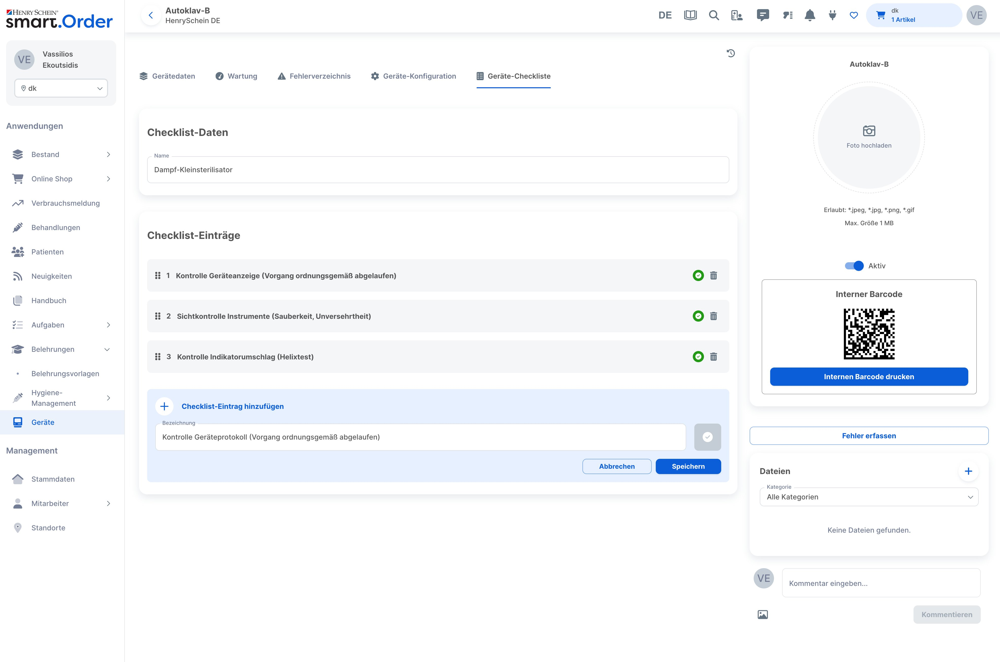
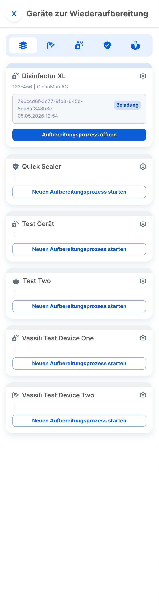

# smart.Order – Code Excerpts

Selected frontend components from [smart.Order](https://www.henryschein.de/de-de/dental/smartorder.aspx), a dental practice management platform developed by Henry Schein. Built with React and TypeScript as part of my work at Cubular.

## Contents

### [`device-checklists/`](./device-checklists/)
A configurable checklist feature for dental reprocessing devices. Includes drag & drop reordering (`@dnd-kit`), a template system, inline editing, and a collapsible form with `react-hook-form`.

→ [View README](./device-checklists/README.md)

---

### [`reprocessing-devices/`](./reprocessing-devices/)
A slide-in drawer panel for managing hygiene workflows across device types. Features an animated CSS tab filter, status-driven CTAs, and cross-panel route awareness.

→ [View README](./reprocessing-devices/README.md)

---

## Tech Stack

React · TypeScript · MUI · @dnd-kit · react-hook-form · @connectrpc/connect-query · react-router · react-i18next

## Note

These are excerpts from a private monorepo. Internal packages and proto-generated API types are part of the host application and are not included here.
